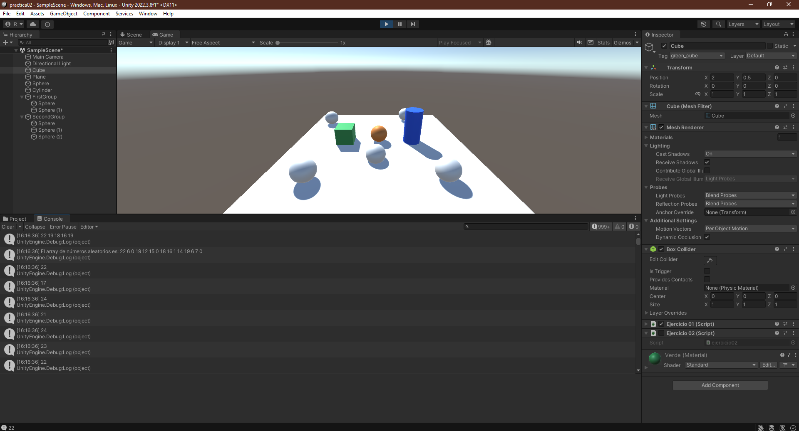
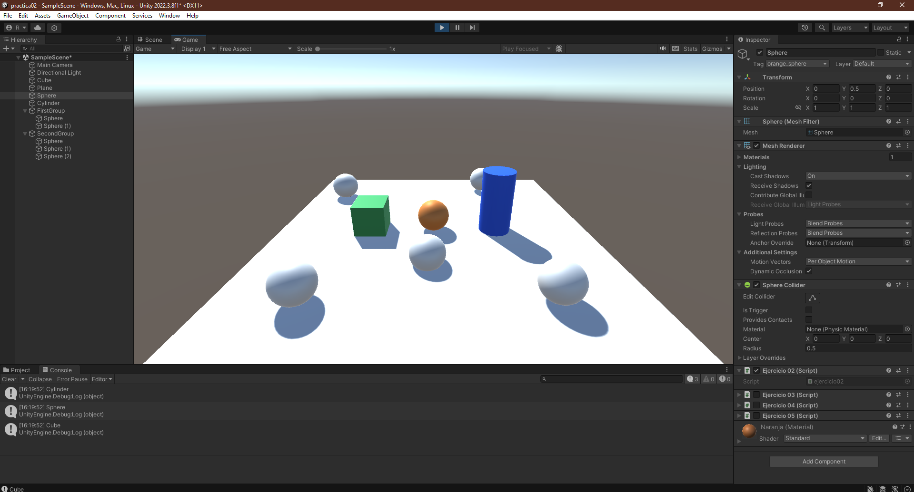
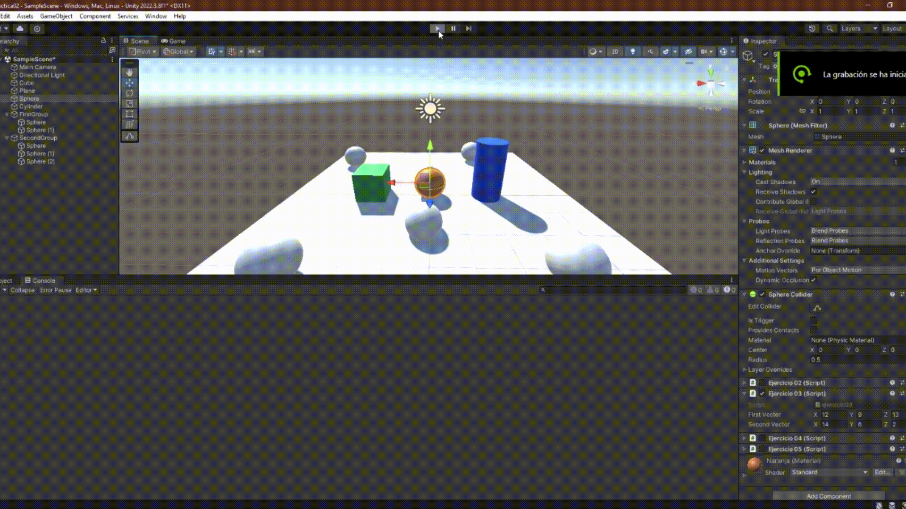
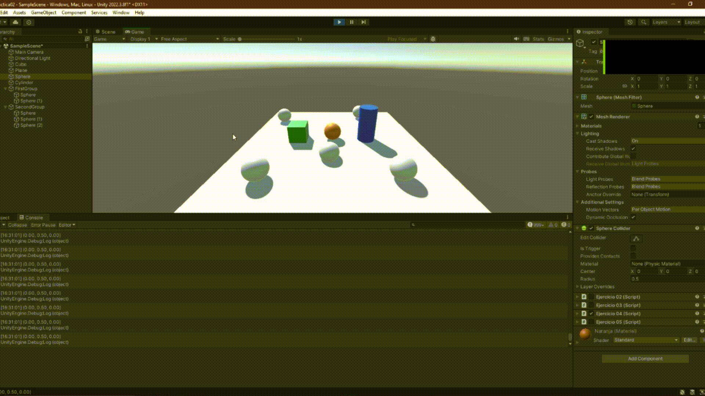
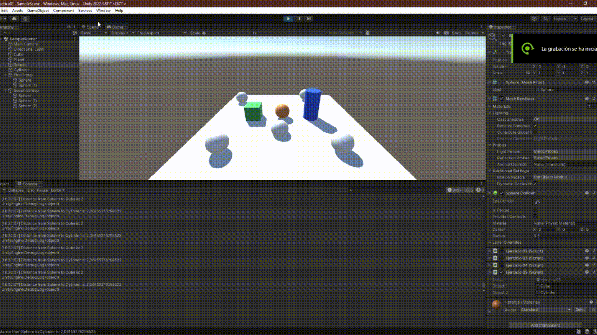
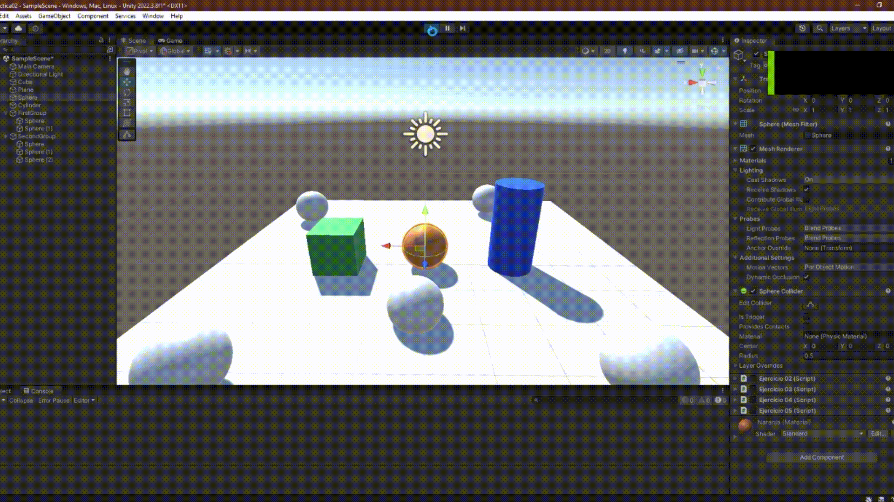
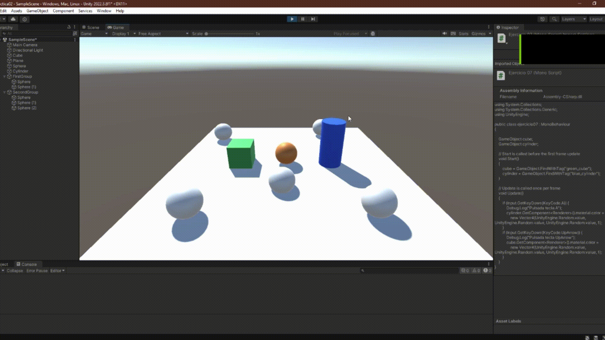
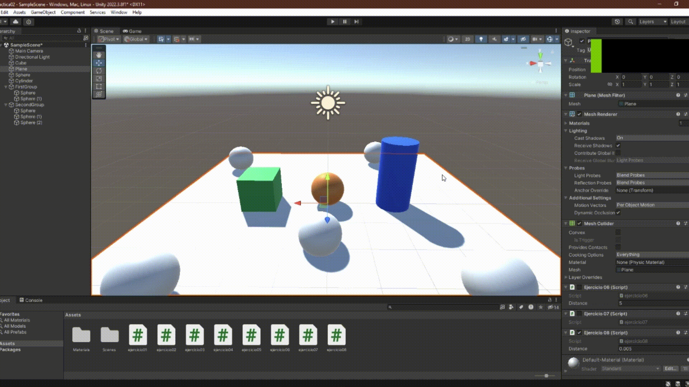

# II-Raimon-Mejias-P02-Introduccion-CSharp
Repositorio que contiene los scripts realizados y un README con la descripción del trabajo de la práctica

## Descripción del trabajo realizado

### Script 01

Se nos pide realizar un primer script que genere un conjunto de valores entre 0 y 25 y constantemente cambie en cada Frame dos elementos de posición

```C#
    void Start()
    {
        randomNumbers = new int[size];
        string topNumbers = "";
        for (int i = 0; i < size; i++) {
            randomNumbers[i] = UnityEngine.Random.Range(minValue, maxValue);
            if (randomNumbers[i] > flag) { topNumbers += $"{randomNumbers[i]} "; }
        }
        string numbers = "El array de números aleatorios es: ";
        foreach(int number in randomNumbers) { numbers += $"{number} "; }
        Debug.Log(topNumbers);
        Debug.Log(numbers);
    }

    // Update is called once per frame
    void Update()
    {
        int index = UnityEngine.Random.Range(0, size - 1);
        randomNumbers[index] = UnityEngine.Random.Range(minValue, maxValue);
        if (randomNumbers[index] > flag) { Debug.Log(randomNumbers[index]); }
    }
```



### Script 02

Se nos pide realizar un segundo script para mostrar los nombres de los objetos de la escena, siendo estos un cubo, una esfera y un cilindro

```C#
    void Start()
    {
      Debug.Log(name);  
    }
```



### Script 03 

Se nos pide realiza run tercer script para calcular los siguientes datos utilizando 2 vectores

- La magnitud de cada uno de ellos. 
- El ángulo que forman
- La distancia entre ambos.
- Un mensaje indicando qué vector está a una altura mayor.

```C#
    void Start()
    {
        Debug.Log($"First vector magnitude: {firstVector.magnitude}");
        Debug.Log($"Second vector magnitude: {secondVector.magnitude}");
        Debug.Log($"The angle they form: {Vector3.Angle(firstVector, secondVector)}");
        Debug.Log($"Their distance: {Vector3.Distance(firstVector, secondVector)}");
        Vector3 result = ((firstVector[1] >= secondVector[1])? firstVector: secondVector);
        Debug.Log($"The higher vector is: {result}");
    }
```



### Script 04

Se nos pide realizar un cuarto script para mostrar en la consola la posición de la esfera en la escena 

```C#
    void Update()
    {
        Debug.Log(transform.position);
    }
```



### Script 05

Se nos pide un quinto script para alinear el cubo y el cilindro 5 unidades de distancia de la esfera

```C#
    void Update()
    {
        double distance1 = Vector3.Distance(transform.position, object1.transform.position);
        Debug.Log($"Distance from {name} to {object1.name} is: {distance1} ");
        double distance2 = Vector3.Distance(transform.position, object2.transform.position);
        Debug.Log($"Distance from {name} to {object2.name} is: {distance2} ");        
    }
```



### Script 06

Se nos pide un sexto script para alinear el cubo y el cilindro 5 unidades de distancia de la esfera

```C#
    void Start()
    {
        sphere = GameObject.FindWithTag("orange_sphere");
        cube = GameObject.FindWithTag("green_cube");
        cylinder = GameObject.FindWithTag("blue_cylinder");        
    }

    // Update is called once per frame
    void Update()
    { 
        Vector3 spherePosition = sphere.transform.position;
        Vector3 cubePosition = cube.transform.position;
        Vector3 cylinderPosition = cylinder.transform.position;
        cube.transform.position = 
            new Vector3(spherePosition.x + distance, cubePosition.y, cubePosition.z);
        cylinder.transform.position = 
            new Vector3(spherePosition.x - distance, cylinderPosition.y, cylinderPosition.z);
    }
```



### Script 07

Se nos pide un septimo script para cambiar el color del cubo y el cilindro cuando se presionan las teclas A y UpArrow

```C#
    void Start()
    {
        cube = GameObject.FindWithTag("green_cube");
        cylinder = GameObject.FindWithTag("blue_cylinder");   
    }

    // Update is called once per frame
    void Update()
    {
        if (Input.GetKeyDown(KeyCode.A)) {
            Debug.Log("Pulsada tecla A");
            cylinder.GetComponent<Renderer>().material.color = 
                new Vector4(UnityEngine.Random.value, UnityEngine.Random.value, UnityEngine.Random.value, 1);
        }
        if (Input.GetKeyDown(KeyCode.UpArrow)) {    
            Debug.Log("Pulsada tecla UpArrow");
            cube.GetComponent<Renderer>().material.color = 
                new Vector4(UnityEngine.Random.value, UnityEngine.Random.value, UnityEngine.Random.value, 1);
        }
    }
```



### Script 08

Se nos pide calcular la distancia de 3 esferas al cubo, elevar la esfera más cercana al cubo y cambiar el color de la más lejana con el espacio

```C#
    void Start()
    {
        spheres = GameObject.FindGameObjectsWithTag("second_group");
        cube = GameObject.FindWithTag("green_cube");
        foreach(GameObject sphere in spheres) { arraySize++; }
        distances = new float[arraySize];
    }

    // Update is called once per frame
    void Update()
    {   
        int minIndex = 0;
        int maxIndex = 0;
        for (int i = 0; i < arraySize; i++) {
            distances[i] = Vector3.Distance(spheres[i].transform.position, cube.transform.position);
            if (distances[i] <= distances[minIndex]) { minIndex = i; }
            if (distances[i] >= distances[maxIndex]) { maxIndex = i; }
        }
        spheres[minIndex].transform.position = spheres[minIndex].transform.position + new Vector3(0, distance, 0);

        if (Input.GetKeyDown(KeyCode.Space)) {
           spheres[maxIndex].GetComponent<Renderer>().material.color = 
                new Vector4(UnityEngine.Random.value, UnityEngine.Random.value, UnityEngine.Random.value, 1);            
        }
    }
```


